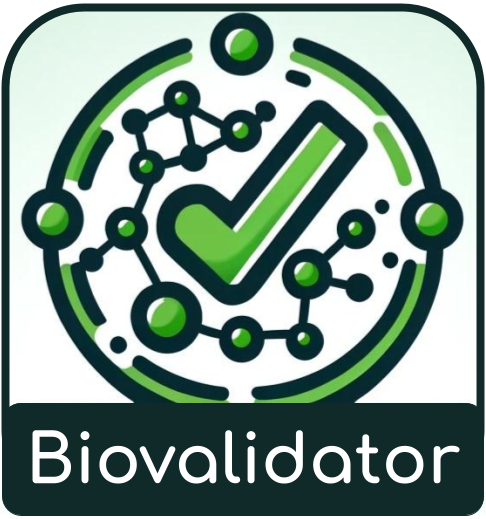

# ELIXIR biovalidator - Extended JSON Schema validator with ontology validation 
  [](https://travis-ci.org/EMBL-EBI-SUBS/json-schema-validator) [](https://www.codacy.com/app/fpenim/json-schema-validator?utm_source=github.com&amp;utm_medium=referral&amp;utm_content=EMBL-EBI-SUBS/json-schema-validator&amp;utm_campaign=Badge_Grade)
[](https://github.com/facebook/jest)

ELIXIR biovalidator is a [JSON Schema](http://json-schema.org/) validator extended from popular javascript library [AJV](https://ajv.js.org/). 
In addition to standard JSON Schema validation, the biovalidator covers many validation use cases related life sciences, including ontology validation and taxonomy validation. 
Furthermore, the biovalidator is capable of running as a server or in CLI mode. 

The biovalidator currently supports JSON Schema draft-06/07/2019-09.

## Breaking changes in recent releases
- graphRestrictions
  - `graph_restriction` renamed to `graphRestriction` to be consistent with other keywords
  - Remove unused `relations` keyword inside `graphRestrictions`
  - Remove unused `direct` keyword inside `graphRestrictions`
  - Rename `include_self` to `includeSelf` keyword inside `graphRestrictions` to be consistent with camel case naming convention
- Merged `validator-cli.js` with `src/server.js`. Now one entry point to the application: `src/biovalidator.js`
- Changes to arguments accepted at the startup
  - `--json` renamed to `--data`
  - Added `--ref`, `--port`, `--baseUrl`, `pidPath`

## Notable features in recent releases
- Support for new keyword `isValidIdentifier`. Validate accessions/IDs using identifiers.org API. 
- Add `queryFields` keyword inside `graphRestrictions` to query for either obo_id or label
- Add caching library improve memory consumption and auto cache evictions
- Fix a bug related to OLS API call in graphRestrictions

## Contents
- [Getting Started](#getting-started)
  - [Prerequisites](#prerequisites)
  - [Installation](#installation)
- [Using biovalidator as a server](#using-biovalidator-as-a-server)
  - [HTTP endpoints](#http-endpoints)
- [Using biovalidator as a CLI command](#using-biovalidator-as-a-cli-command)
- [Startup arguments](#startup-arguments)
- [Extended keywords for ontology and taxonomy validation](#extended-keywords-for-ontology-and-taxonomy-validation)
  - [graphRestriction](#graphrestriction)
  - [isChildTermOf](#ischildtermof)
  - [isValidTerm](#isvalidterm)
  - [isValidTaxonomy](#isvalidtaxonomy)
  - [isValidIdentifier](#isvalididentifier)
- [Running in Docker](#running-in-docker)
- [License](#license)

## Getting Started

### Prerequisites
- [Node.js](https://nodejs.org/en/about/) - v22+
- [npm](https://www.npmjs.com/) 
You can also run the [biovalidator using docker](#running-in-docker) without installing node or npm. 

### Installation

- Install Node.js: https://nodejs.org/en/ (v22+)
- Check node and npm version
```shell
node -v
npm -v
```
- Clone project and install dependencies:
```
git clone https://github.com/elixir-europe/biovalidator.git
cd biovalidator
npm install
```
The browser interface is distributed with pinned, self-hosted assets, so it does not need a CDN or other network access for its editor, styles, scripts, or logo. Maintainers should run `npm run build:ui` after changing files in `src/browser`; the Docker build also regenerates these assets before pruning build-only dependencies.

- Run test cases to see everything is in order
```
npm test
```

## Using biovalidator as a server

By default, biovalidator will start as a server. Read [startup arguments](#startup-arguments) section for more server options. 
```
node src/biovalidator
```

Once the server is up and running it can be accessed in your browser at [http://localhost:3020/](http://localhost:3020/). 
The biovalidator also exposes an endpoint for validation: [http://localhost:3020/validate](http://localhost:3020/validate). 

### HTTP endpoints

| Method | Path | Purpose |
| --- | --- | --- |
| `GET` | `/` | Open the bundled validation interface. |
| `GET`, `POST` | `/validate` | View a request example or validate data against a JSON Schema. |
| `GET` | `/examples` | Retrieve FEGA validation examples. |
| `GET`, `DELETE` | `/cache` | Inspect schema/API cache state or clear transient caches. |
| `GET` | `/health` | Inspect process, validation, and cache health metrics. |

See the concise [HTTP API reference](docs/api.md) for response semantics and [server security controls](docs/security.md) for outbound policy, worker isolation, cache behavior, and configurable limits.

The `/validate` POST endpoint accepts JSON as data and has the following structure.
```json
{
  "schema": {},
  "data": {}
}
```
- schema: JSON Schema to validate the data
- data: data to be validated using given JSON Schema

Make sure to add content-type header if there are any problems using the API.
```
Content-Type: application/json
```

**Example:** Sending a POST request with the following body:
```json
{
  "schema": {
    "$schema": "http://json-schema.org/draft-07/schema#",
    "type": "object",
    "properties": {
      "alias": {
        "description": "A sample unique identifier in a submission.",
        "type": "string"
      },
      "taxonId": {
        "description": "The taxonomy id for the sample species.",
        "type": "integer"
      },
      "taxon": {
        "description": "The taxonomy name for the sample species.",
        "type": "string"
      },
      "releaseDate": {
        "description": "Date from which this sample is released publicly.",
        "type": "string",
        "format": "date"
      }
    },  
    "required": ["alias", "taxonId" ]
  },
  "data": {
    "alias": "MA456",
    "taxonId": 9606
  }
}
```
will produce a response like:

HTTP status code `200`
```json
[]
```
An example of a validation response with errors:

HTTP status code `200`
```json
[
  {
    "errors": [
        "must have required property 'value'"
    ],
    "dataPath": ".attributes['age'][0].value"
  },
  {
    "errors": [
        "should NOT be shorter than 1 characters",
        "must match format \"uri\""
    ],
    "dataPath": ".attributes['breed'][0].terms[0].url"
  }
]
```
Where *errors* is an array of error messages for a given input identified by its path on *dataPath*. 
There may be one or more error objects within the response array. An empty array represents a valid validation result.

### Changing the logging directory
By default, biovalidator will log to the console and `./log` directory. Log files are daily rotated. 
You can change the default logging directory by specifying an environment variable `BIOVALIDATOR_LOG_DIR`. 
Example in linux environment:
```shell
export BIOVALIDATOR_LOG_DIR=./new_log_dir
```

### Interacting with biovalidator cache
In server mode, Biovalidator caches compiled validators, remotely referenced schemas, and responses from external APIs. Remote/API response caches are shared across users and validation workers, they are not recreated per request. `GET /cache` reports schema inventories, bounded-cache metrics, and remote URL keys without exposing API query keys or cached bodies. `DELETE /cache` clears transient entries and accepts `scope=schemas`, `scope=api`, or `scope=all` (the default). Local schemas registered with `--ref` are configuration and are not removed.

Transient schema and validation API cache entries expire after six hours by default. Set `BIOVALIDATOR_CACHE_TTL_SECONDS` to a positive whole number of seconds to change the lifetime. The setting is read at process startup, so changing it requires a restart. For example, use `3600` for one hour or `86400` for one day. The FEGA examples cache has its own `FEGA_EXAMPLES_CACHE_TTL_SECONDS` setting.

These endpoints are not protected; restrict access as appropriate. See the [HTTP API reference](docs/api.md) for the response fields.

## Using biovalidator as a CLI command
The biovalidator can also be run as a CLI application. If you provide `--schema` and `--data` as parameters to the application, it will execute in CLI mode. 
To see all the available options, run `node ./src/biovalidator --help`
```
$ node ./src/biovalidator --help

ELIXIR biovalidator: JSON Schema validator with ontology extension
usage: node ./src/biovalidator.js [--schema=path/to/schema.json]
[--data=path/to/data.json] [--ref=path/to/ref/dir]

Options:
      --help     Show help                                             [boolean]
      --version  Show version number                                   [boolean]
      --baseUrl  base URL for the server. Only valid in server mode.
      --pidPath  PID file name and path. Only valid in server mode.
  -s, --schema   path to the schema file.
  -d, --data     path to the data file.
  -r, --ref      path to referenced schema directory/file/glob pattern.
      --remoteRef allowlisted remote schema URL to warm at server startup; repeatable.
  -p, --port     exposed port in server mode. Only valid in server mode.

Examples:
  node ./src/biovalidator.js                Runs in CLI mode to validate
  --data=test_data.json                     'test_data.json' with
  --schema=test_schema.json                 'test_schema.json'
```

## Startup arguments
- `--ref`:
If you have a set of local schemas that will be used as `$ref` in your validating schema, these can be passed to biovalidator using `--ref` argument.
The `--ref` argument can be used in both server and CLI mode. `--ref` accepts file path, directory and glob patterns as values. 
Each schema must define a unique, non-empty `$id`. Schemas are registered in the matching JSON Schema draft context and compiled on first use; an exact local `$id` match avoids a network request.
When parsing glob patterns, it is better to wrap with `'` to avoid parsing them by command line. 
```
node src/biovalidator --ref=/path/to/reference/schema/dir/*.json
node src/biovalidator --ref '/path/to/reference/schema/dir/*.json'
```

- `--remoteRef`:
In server mode, repeat this option to fetch and compile important allowlisted remote schemas before the listener starts. This preserves `$id` lookup and warms the shared remote response cache.
```shell
node src/biovalidator --remoteRef https://raw.githubusercontent.com/M-casado/fega-metadata-schema/main/schemas/common/schema.json
```

- `--port`:
By default server will run on port 3020. To change the exposed port `--port` can be provided as an argument. Only works in server mode. 
```
node src/biovalidator --port=8080
```

- `--baseUrl`:
Base URL can be provided as an argument to change the URL of the server. Only works in server mode.
```
node src/biovalidator --baseUrl=/schema  # will serve the content under http://localhost:3020/schema
```

- `--pidPath`:
  Path to the PID file. Application will run the PID to the given file. The default is `./server.pid`. Only works in server mode.
  Also note that, this is the path to the file and not the directory it will be written to.
```
node src/biovalidator --pidPath=/pid/file/path/server.pid
```

- `--logDir`
This should be added as an environment variable. Can be provided to specify the directory of the log files. 
Log files will be rotated every 24 hours. Only works in server mode.
```
node src/biovalidator --logDir=/log/directory/path
```

### Most of the arguments can be provided as environment variables as well
- BIOVALIDATOR_LOG_DIR
- BIOVALIDATOR_PORT
- BIOVALIDATOR_BASE_URL
- BIOVALIDATOR_PID_PATH
- BIOVALIDATOR_DEPLOYED_AT
- BIOVALIDATOR_REVISION
- BIOVALIDATOR_CACHE_TTL_SECONDS

`BIOVALIDATOR_DEPLOYED_AT` and `BIOVALIDATOR_REVISION` override the deployment metadata reported by `/health`. Without them, a local server uses its process start time and the current Git commit when available.

Example:
```
export BIOVALIDATOR_LOG_DIR=./new_log_dir
export BIOVALIDATOR_PORT=3020
node src/biovalidator
```

## Extended keywords for ontology and taxonomy validation
The biovalidator supports four extended keywords for ontology and taxonomy validation: `graphRestriction`, `isChildTermOf`, `isValidTerm` and `isValidTaxonomy`.
Ontology terms are looked up using the [OLS4 search API](https://www.ebi.ac.uk/ols4/api/search). If OLS4 is unavailable, validation fails with a service error rather than reporting the term as invalid.

### graphRestriction
`graphRestriction` checks whether an ontology term is a child of one of the parent terms in `classes`. It requires one or more parent terms and ontology IDs. Ontology IDs are case-sensitive and are usually lower case.

`queryFields` is optional. By default, terms are matched against `obo_id`, for example `UBERON:0000955`. Use `["label"]` to validate labels, or `["obo_id", "label"]` to accept either. Matching is exact and case-sensitive.

This is an asynchronous keyword, so the schema must have `"$async": true` at its root.

Schema:
```json
{
    "$schema": "http://json-schema.org/draft-07/schema#",
    "$id": "http://schema.dev.data.humancellatlas.org/module/ontology/5.3.0/organ_ontology",
    "$async": true,
    "properties": {
        "ontology": {
            "description": "A term from the ontology [UBERON](https://www.ebi.ac.uk/ols4/ontologies/uberon) for an organ or a cellular bodily fluid such as blood or lymph.",
            "type": "string",
            "graphRestriction":  {
                "ontologies" : ["obo:hcao", "obo:uberon"],
                "classes": ["UBERON:0000062","UBERON:0000179"],
                "includeSelf": false
            }
        }
    }
}
```
Data:
```json
{
    "ontology": "UBERON:0000955"
}
```

### isChildTermOf
`isChildTermOf` checks whether an ontology term URL is a child of `parentTerm` in the selected ontology. Both `parentTerm` and `ontologyId` must refer to entries in OLS4.

This is an asynchronous keyword, so the schema must have `"$async": true` at its root.

Schema:
```json
{
  "$schema": "http://json-schema.org/draft-07/schema#",
  "$async": true,
  "properties": {
    "term": {
      "type": "string",
      "format": "uri",
      "isChildTermOf": {
        "parentTerm": "http://purl.obolibrary.org/obo/PATO_0000047",
        "ontologyId": "pato"
      }
    }
  }
}
```
Data:
```json
{
  "term": "http://purl.obolibrary.org/obo/PATO_0000383"
}
```

### isValidTerm
`isValidTerm` checks whether an ontology term URL exists in OLS4.

This is an asynchronous keyword, so the schema must have `"$async": true` at its root.

Schema:
```json
{
  "$schema": "http://json-schema.org/draft-07/schema#",
  "$async": true,
  "properties": {
    "url": {
      "type": "string",
      "format": "uri",
      "isValidTerm": true
    }
  }
}
```
Data:
```json
{
  "url": "http://purl.obolibrary.org/obo/PATO_0000383"
}
```

### isValidTaxonomy
This custom keyword evaluates if a given *taxonomy* exists in ENA's Taxonomy Browser. It is applied to a string (url) and **passes validation if the taxonomy exists in ENA**. It can be applied to any string defined in the schema.

This keyword works by doing an asynchronous call to the [ENA API](https://www.ebi.ac.uk/ena/taxonomy/rest/any-name/<REPLACE_ME_WITH_AXONOMY_TERM>) that will respond with the required information to determine if the term exists or not.
Being an async validation step, whenever used in a schema, the schema must have the flag: `"$async": true` in its object root.

Schema:
```json
{
  "$schema": "http://json-schema.org/draft-07/schema#",
  "title": "Is valid taxonomy expression.",
  "$async": true,
  "properties": {
    "value": { 
      "type": "string", 
      "minLength": 1, 
      "isValidTaxonomy": true
    }
  }
}
```

Data:
```json
{
  "metagenomic source" : [ {
    "value" : "wastewater metagenome"
  } ]
}
```

### isValidIdentifier
Evaluates if a given *identifier* has a correct format using identifiers.org resolution API. The keyword is applicable to the `string` data type. 

The keyword will do an asynchronous call to the [identifier.org API](https://resolver.api.identifiers.org/) to resolve the URL for the given CURIE. 
Being an async validation step, whenever used in a schema, the schema must have the flag: `"$async": true` in its object root.

The keyword has two properties: `prefixes` and `prefix`. Only one of them is allowed in a block and `prefix` will take the priority in case both are provided. 
- `prefix` define one namespace/prefix for the expected identifier/accession. In the data, field should only contain the ID/accession without the namespace. 
- `prefixes` define a set of allowed namespaces/prefixes. In the data, field should contain a valid CURIE (namespace:id format)

:warning: At the moment only the format of the identifier/accession is checked against the identifier.org. Therefore, this does not guarantee the existence of the data record.

#### isValidIdentifier example 1
Schema:
```json
{
  "$schema": "http://json-schema.org/draft-07/schema#",
  "$async": true,
  "properties": {
    "SampleId": {
      "type": "string",
      "isValidIdentifier": {
        "prefix": "biosample"
      }
    }
  }
}
```
Data:
```json
{
  "SampleId": "SAMEA2397676"
}
```

#### isValidIdentifier example 2
Schema:
```json
{
  "$schema": "http://json-schema.org/draft-07/schema#",
  "$async": true,
  "properties": {
    "resourceId": {
      "type": "string",
      "isValidIdentifier": {
        "prefixes": ["biosample", "arrayexpress"]
      }
    }
  }
}
```
Data:
```json
{
  "resourceId": "biosample:SAMEA2397676"
}
```

## Running in Docker
A Dockerized version of biovalidator is available on [quay.io](https://quay.io/repository/ebi-ait/biovalidator). 
This image can be used to run the validator without cloning this repository. 

Pull docker image from [quay.io](https://quay.io/repository/ebi-ait/biovalidator)
```shell
docker pull quay.io/ebi-ait/biovalidator:2.2.2
```
Run in server mode
```shell
docker run -p 3020:3020 -d quay.io/ebi-ait/biovalidator:2.2.2
```
Run in server mode with a one-hour cache lifetime
```shell
docker run -p 3020:3020 -e BIOVALIDATOR_CACHE_TTL_SECONDS=3600 -d quay.io/ebi-ait/biovalidator:2.2.2
```
Run in onetime CLI mode
```shell
docker run quay.io/ebi-ait/biovalidator:2.2.2 --schema /path/to/schema.json --data /path/to/data.json
```

## Development
For development purposes using [nodemon](https://nodemon.io/) is useful. It reloads the application every time something has changed on save time.
```
nodemon src/biovalidator
```

## License
For more details about licensing see the [LICENSE](LICENSE.md).
